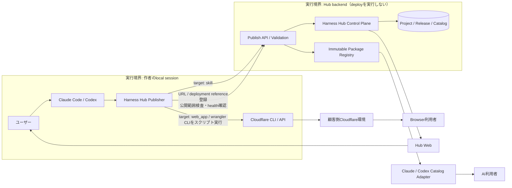

# Harness Hub プラットフォーム構想

> Status: concept / decision proposal
>
> Updated: 2026-07-16
>
> Scope: 検討・設計のみ。実装、工数見積もり、リリース承認は含まない。
>
> Tracking: Beads `harness-ny2`
>
> Decision requested: Stage 0 Discovery Pilotの着手承認（§16 HH-D01〜D14の設計判断の採用を含む）。承認者: 提供者代表（本リポジトリowner）。判断基準: §19の仮説・検証計画がStage 0で判定可能であること、および§14 Stage 0開始条件の妥当性。期限: Stage 0参加者募集の開始前。却下・修正時: 構想を棚上げし、§10.1相当の手動Pilotのみを任意で継続する。

## 1. エグゼクティブサマリー

Harness Hubが解くべき中心課題は、「プラグインを置く場所がないこと」ではない。

> ユーザーが自分で業務課題を見つけ、Claude Code / Codexと解決物を作り、Git・Pull Request・CI・version・cache・デプロイを意識せず、社内の必要な人へ公開できること。

推奨するプロダクトは、独自の作成環境や実行環境をすべて抱えるフルプラットフォームではなく、**Self-Service Publish Control Plane**である。

中心設計は次のとおり。

1. 作成と試行は、ユーザーが使い慣れたClaude Code / Codexで行う。
2. ユーザーの公開操作は「公開する」の1つにする。
3. Hubは検査、版管理、承認、配布、公開停止、rollbackを担当する。
4. Git branch、commit、push、PR、CI、merge、version更新、cache更新を利用者へ見せない。
5. Webは公開後の管理面、Claude Code / Codexは作成・公開・インストール・実行の操作面とする。
6. 同じ管理面から、利用者に応じて2つの公開出口を選べるようにする。
   - **Skill / Harness**: Claude Code / Codex利用者がネイティブに追加して使う。
   - **Web App**: Claude Code契約のない社員もブラウザから使う。
7. Hub自身は2つのruntimeを運営しない。Skillは利用者のローカル環境、Web Appは利用者または顧客のCloudflare環境で動かす。
8. Web Appは、Publisherが作者のlocal sessionで実行するCloudflare CLI（wrangler）/ APIのスクリプトで公開し、Hubは公開URLと管理情報を保持する。Cloudflare MCPはdeploy主経路に採用しない（§8.2、HH-D13）。独自デプロイ基盤は反復的な失敗が確認された場合だけ追加する。
9. 成果ダッシュボード、共通Runtime Connector、Hosted Harnessは初期MVPから外し、再利用が成立した後の任意拡張にする。

利用者の体験は次の6語へ集約する。

```text
作る → 試す → 公開する → チームで見つける → 使う → 改善する
```

## 2. 思考リセット後の再定義

### 2.1 リセットの意味

思考リセットは既存成果物の削除ではない。これまでの案を正解とみなさず、現在の課題から設計を組み直すことである。

再検証では、従来案の次の前提をいったん外した。

- 最初に成果物ダッシュボードが必要である。
- 全ハーネスを共通Connectorから実行する必要がある。
- 独自のHosted Harness形式が標準経路である。
- Web上にも会話型Creatorが必要である。
- Plugin Marketplaceと成果計測を同じMVPで作る必要がある。

### 2.2 第一印象で見つかった問題

従来案には、次の2つのプロダクトが混在していた。

1. Hosted Harness + Runtime Connector + Results Dashboard
2. ユーザー作成Skill / Pluginの公開・管理・社内共有基盤

今回、利用者が明示した障壁は、2. のユーザー作成Skill / Pluginを公開・共有する基盤の欠如である。1を先に作ると構築・運用範囲が広がる一方、Git公開の難しさを直接解決できない。

この障壁認識は口頭ヒアリングに基づく未検証前提であり、実施日・対象者数・記録を伴う一次資料は存在しない（従来案との比較経緯はBeads `harness-ny2`に記録がある）。そのため、この前提自体を§19の仮説H0としてStage 0で再確認する。

障壁の説明として検討した代替原因と扱い:

| 代替原因 | 扱い |
| --- | --- |
| 公開需要そのものの不足 | 棄却しきれない。§19 H0 / H4で検証する |
| 組織のIT統制がGit / PRを意図的な統制点にしている | 監査mirror（§7.1）と§11.2の統制主体の行で扱いを定義し、Stage 0で確認する |
| 作成能力側の障壁（そもそも作れない） | Discovery Pilot（§10.1）の相談記録で切り分ける |

さらに、西山モデル（§3）を取り入れるには「Claude Code利用者だけが使えるSkill」に閉じず、非契約者がブラウザで使えるWeb Appも出口として扱う必要がある。ただし、SkillとWeb Appを同じ実行物として無理に統合してはならない。

### 2.3 改善後の中心命題

```text
ユーザーが解決物を作る
  → Hubが公開の複雑さを引き受ける
  → 利用者に合わせた出口へ届ける
  → 提供者は教育と有料助言に集中する
```

Hubが統合するのはruntimeではなく、公開に必要な管理情報である。

## 3. 西山モデルの抽象化と適用

### 3.1 抽象化した原則

西山モデルは口頭共有に基づく再構成であり、原典資料（発表・記事・事例記録）は未確認である。元モデルが成立した条件（対象者のスキル水準・組織規模・実績規模）も未確認のため、本文脈への転用可否は§19の仮説H0としてStage 0で検証する。

西山モデルの強みは、提供者が個別アプリの受託開発者にならない点にある。

| 原則 | 内容 |
| --- | --- |
| 課題の所有 | ユーザーが自分の業務課題を見つける |
| 解決物の所有 | ユーザーがAIと自分で作る |
| 公開の自動化 | CLI・スクリプト等の自動化された道具がインフラ操作を隠す |
| 成果の可視性 | URLを開けば他者も成果を使える |
| 支援の限定 | 提供者は教育と困った時の助言を提供する |
| 納期責任の分離 | 個別成果物の納期・完成責任はユーザーが持つ |
| 学習の蓄積 | 作成例と改善履歴が次の自己解決を容易にする |

### 3.2 Harness Hubへの対応関係

| 西山モデル | Harness Hub |
| --- | --- |
| ユーザーがアプリを作る | ユーザーがSkill / HarnessまたはWeb Appを作る |
| Cloudflare MCPでデプロイ | PublisherがSkill公開とWeb App公開を自動化する（deployはwrangler CLIのスクリプト実行。§8.2） |
| デプロイURLを共有 | Hubの業務ツール一覧から追加または開く |
| 誰でもブラウザ利用 | Web App出口ならClaude Code契約なしで利用可能 |
| 困った時だけ相談 | 予約制の有料office hourを利用する |
| 提供者は納品しない | 提供者は個別開発の完成・納期を請け負わない |

### 3.3 そのまま真似しない部分

Skill / HarnessとWeb Appには異なる特性がある。

| 観点 | Skill / Harness | Web App |
| --- | --- | --- |
| 主な利用者 | Claude Code / Codex利用者 | インターネットへ接続できる社員 |
| 実行環境 | 利用者のローカルAI環境 | Browser + Cloudflare |
| 強み | 作成と改善が速く、ローカル文脈を使える | 非AI利用者を含めて利用範囲が広い |
| 注意点 | 利用者に対象AI製品が必要 | hosting、認証、データ、運用責任が生じる |
| Hubの役割 | package、catalog、install、version | 公開状態、URL、owner、version、rollback参照 |

1つのSkillを自動的にWeb Appへ変換することはMVPの約束にしない。共通化するのはProjectとReleaseの管理であり、実行物とruntimeは出口ごとに分離する。

## 4. プロダクト定義

### 4.1 利用者向けの呼び方

UIではSkill、Plugin、Harness、Package、Deploymentという語を使い分けず、原則として **業務ツール** と呼ぶ。

公開時にだけ、利用者の範囲を質問する。

```text
誰に使ってほしいですか？

1. Claude Code / Codexを使う人
   → AI用ツールとして公開

2. 社内の誰でも
   → Webアプリとして公開
```

あとから、もう一方の出口にも同じProjectから公開できる（§4.2の2つのTargetChannel）。

### 4.2 内部用語

| 用語 | 定義 |
| --- | --- |
| `Project` | 1つの業務課題と解決物を表す管理単位 |
| `TargetChannel` | 1つのProjectにおける公開出口。`skill`または`web_app`ごとに安定版を持つ |
| `Release` | 1つのTargetChannelに属する、変更不能な1版 |
| `target` | `skill` または `web_app` |
| `SkillPackage` | AI製品へ配布する静的package |
| `DeploymentReference` | Web Appの公開先URLとprovider側reference |
| `CatalogEntry` | Projectを表す1枚のcard。各TargetChannelの利用導線をまとめる |
| `PublishRequest` | 検査から公開までの1回のtransaction |
| `Workspace` | 社内共有と権限の境界 |
| `PackageRegistry` | `SkillPackage`のimmutable保存先（§6図のImmutable Package Registry） |
| `Harness` | Skill一式の配布単位。初期範囲はskills-only packageで、`SkillPackage`として配布される。現行`plugins/harness-creator`の成果物（§15） |
| `提供者` | 教育・有料助言・Platform運用の主体。旧表記「支援者」と同一で、本書では「提供者」へ統一する |

```text
Project
  ├─ TargetChannel target=skill
  │    ├─ stable_release_id
  │    └─ Releases
  │         ├─ package_ref
  │         └─ marketplace_ref
  └─ TargetChannel target=web_app
       ├─ stable_release_id
       └─ Releases
            ├─ deployment_url
            └─ deployment_reference
```

1つのCatalogEntryに2つの利用導線を表示できるが、SkillとWeb Appの安定版はそれぞれ独立している。

業務ツール名はWorkspace内で一意とする。同名衝突時は後発側に名称変更を求め、内部ではProject IDで識別する。

### 4.3 不変条件

- 一般利用者はGitHubアカウントを必要としない。
- 一般利用者はbranch、commit、push、PR、CI、mergeを操作しない。
- 一般利用者はversion番号とcachebusterを編集しない。
- 公開処理が失敗しても、現在の安定版は利用可能なままにする。
- Releaseは変更せず、TargetChannelごとの安定版pointerの切り替えで更新・rollbackする。
- Web Appのruntime、顧客DB、secretを原則としてHub所有にしない。
- 利用者が自分のpackageと公開情報をexportできるようにする。exportにはWeb AppのURL・deployment reference・公開履歴を含む（顧客側リソースの実体は元より顧客所有である。§8.2）。

## 5. UI / UXと責務分離

### 5.1 画面ごとの役割

| 場所 | 主な役割 |
| --- | --- |
| Claude Code / Codex | 作成、試行、公開指示、AI用ツールの追加・実行、target=web_appのdeploy実行（wrangler CLIのスクリプト実行） |
| Harness Hub Web | 一覧、詳細、owner、権限、承認、公開状態、rollback |
| Browser | Web Appの利用 |
| Backend | 検査、版管理、配布adapter、監査記録 |
| Cloudflare等 | Web App runtimeと顧客側resource（D1 / KV / R2を含む） |

Web上に別の会話型Creatorを初期構築しない。利用者がすでに作業しているClaude Code / CodexからWebへ移動させないためである。

### 5.2 作者の主動線

```text
Claude Code / Codexで作る
  → ローカルで試す
  → 「チームに公開して」または /harness-hub:publish
  → 公開対象を選ぶ
  → 検査中
  → 公開済み
  → 完了URLを開く
```

Web uploadは代替経路にできるが、主動線にはしない。ZIP作成、manifest確認、ファイル選択という新しい障壁を生むためである。

再公開（改善する）の動線: 同じ作業ディレクトリからのpublishは既存Projectの新Releaseとして扱い、確認画面で新規 / 更新を利用者が選べる。§7.1のversion自動採番は、この新規 / 更新の同定を前提とする。

### 5.3 利用者の動線

AI用ツール:

```text
HubまたはClaude Code / Codexの一覧で見つける
  → 「追加する」
  → ネイティブ環境で使う
```

Web App:

```text
Hubの一覧で見つける
  → 「Webアプリを開く」
  → Browserで使う
```

### 5.4 初心者に見せる状態

- 下書き
- 検査中
- 修正が必要
- 承認待ち
- 公開に失敗しました（安定版はそのまま）
- 公開済み
- 更新あり
- 公開停止
- 前の版へ戻しました

「公開に失敗しました」は§7.2の`Publishing → Failed`に対応する。使われなくなったツールの公開停止・廃止もownerの1操作で行える（発動権限は§7.2）。

Git、CI、merge、cache purge等の内部状態は表示しない。失敗時も技術ログではなく「直す場所」「理由」「AIに修正を依頼するボタン」を示す。

## 6. 推奨アーキテクチャ



実行境界: target=web_appのdeployは、作者のlocal sessionでPublisherがCloudflare CLI（wrangler）/ APIをスクリプトとして実行する。Hub backendはdeployを実行せず、URL・release情報の登録、公開範囲検査、HTTPレベルのhealth確認だけを受け持つ。credentialは作者local sessionとCloudflare側のOAuth / token管理に留まり、Hubを通過しない（§4.3 / §6.2と整合）。

Cloudflare MCPはdeploy主経路にしない。MCP serverは目的外のツール群が混入し、実行可能な操作の範囲を監査しづらいためである。CLIのスクリプト実行なら、実行コマンド・引数・exit codeをそのまま監査記録に残せる（HH-D13、§16.1）。

Hub Web自身の認証は新規に作らず、顧客Workspaceの既存IdP / SSOへ委譲する（§10.2）。

### 6.1 共通Control Plane

共通で持つ情報は次に限定する。

- Workspace
- Project、owner、説明
- Release、target、公開状態
- visibility、承認、監査履歴
- CatalogEntry
- validation結果
- TargetChannelごとのstable release pointer
- rollback履歴
- Web App URLまたはSkill package reference

Hub障害時の縮退方針: 導入済みSkillと公開済みWeb Appは影響を受けず動作し続け、新規公開・追加・更新のみ停止する。復旧は提供者のPlatform運用責任（§11.2）に含む。

### 6.2 Hubが持たないもの

- 個別Skillのローカル実行runtime
- Web Appの本番runtime
- 顧客側DBの実データ
- 顧客側Cloudflare secret
- 個別アプリの保守運用責任
- 会話全文や業務入力の自動収集

この境界により、利用者が増えるほど提供者のhosting責任と個別保守が比例して増える構造を避ける。

## 7. 公開処理の契約

### 7.1 Git工程の置き換え

| 初心者には難しい操作 | Hub内部の処理 | 利用者表示 |
| --- | --- | --- |
| branch作成 | 一時PublishRequestを生成 | 検査中 |
| commit / push | immutable artifactを保存 | 検査中 |
| Pull Request | policy判定またはWorkspace承認request | 承認待ち |
| CI確認 | package検査、secret scan、試験install/build | 修正が必要 / 公開準備完了 |
| merge | stable pointerへ昇格 | 公開済み |
| version更新 | 差分とcontent hashから自動採番 | 更新1、更新2等 |
| cache更新 | immutable URLとcatalog pointerを自動更新 | 追加可能 / 更新あり |
| rollback | stable pointerを以前のReleaseへ戻す | 前の版へ戻しました |

Git repositoryは必要なら監査用mirrorとして使えるが、公開の正面インターフェースにはしない。PRも公開範囲が広い高リスク案件の内部監査手段であり、一般利用者の操作にはしない。

### 7.2 公開処理と公開版の状態

`PublishRequest`の処理状態、`Release`の公開状態、安定版pointerの操作を分離する。

PublishRequest:

```text
Draft
  → Validating
      ├─ Needs Fix → Draft
      └─ Ready
           ├─ Approval Pending → Approved（管理者承認）
           └─ Approved（policyによる自動承認）
           → Publishing
                ├─ Failed
                └─ Published
```

承認必須のPublishRequestは、`Approved`になるまで`Publishing`へ進めない。

MVPの状態機械サブセット: MVPではpolicy判定でYellow / Red相当と判定されたPublishRequestを`Needs Fix`へ遷移させ、対象外の理由を表示する。`Approval Pending`はStage 2のapproval queue有効化までは到達しない状態として扱う（§9 / §10.2）。

同一TargetChannelへのPublishRequestは直列化し、先行するrequestが終端状態（`Published` / `Failed` / `Draft`差し戻し）になるまで後続は`Draft`に留める。

Releaseの`Suspended`（公開停止）は、ownerまたはWorkspace管理者が発動できる。

Release:

```text
Available | Suspended | Deprecated
```

TargetChannelの操作:

```text
Promote(release_id)
Rollback(previous_release_id)
```

`Published`になったPublishRequestは`Available`なReleaseを生成し、続けて`Promote`する。承認必須policyでは、PublishRequestが事前に`Approved`になるまで公開処理を開始せず、失敗時は既存stable pointerを維持する。

`Rolled Back`はRelease状態ではない。過去Releaseを安定版へ再昇格するpointer操作と、その監査eventである。初回Releaseにはrollback先が存在しないため、2版目以降だけrollback先を検査する。

Skill packageの保存とCatalog pointerの更新はatomicに扱い、失敗時は旧stable releaseを維持する。

Web App MVPでは外部deploymentとCatalog更新を完全にatomicにはできない。deployment成功後にCatalog昇格が失敗した場合は、旧stableを維持し、新deploymentを`orphan_candidate`として記録する。ownerが再登録するか、Workspace管理者へCloudflare側の削除を依頼する（一般作者はCloudflareを直接操作しない。§8.2）。orphan_candidateの滞留はHub WebでownerとWorkspace管理者に表示し、一定期間後に管理者へ通知するまでをHubの責務、実体の削除は顧客側の責務とする（§11.2）。

### 7.3 最小検査

共通:

- ownerと公開範囲
- secret・個人情報の混入
- 必須説明、入力、出力、利用条件
- 対象adapterとの互換性
- sampleまたはpreview
- 2版目以降の場合のrollback先

Skill固有:

- package構造とmanifest補完
- skills-only制約
- 禁止されたHook、script、binary、任意shellの検出
- instructions内の高リスク操作パターン（一括送信・削除・外部送信の指示等）の検出。検出時はYellowへ降格する
- 試験install
- Catalog生成

Web App固有:

- build成功
- 公開先Workspaceの確認
- 認証要否と公開範囲
- deployment完了とhealth確認
- URLとrollback referenceの取得

MVPでの実施位置: build成功とdeployment完了は、作者local sessionでのwrangler CLI実行結果（exit code・出力）をPublisherが収集してHubへ報告する。HubはURL登録時に公開範囲検査とHTTPレベルのhealth確認を行う。deploy工程そのものの検証は、Stage 3 Deployment Adapterを導入する場合にそちらへ回収する（§6 / §14）。

これらは公開に必要な技術的検査であり、業務要件、法令適合性、情報セキュリティ全体、データの正確性、継続稼働を認証・保証するものではない。業務上の最終acceptanceはownerが行う。Yellow / Red案件のreviewも、合意した観点に対するreviewであり、成果や安全性全体の保証ではない。

## 8. 2つの公開出口

`target`は完成済み成果物の公開先を示す。`target=skill`には`SkillPackage`、`target=web_app`にはbuild可能なWeb App成果物が必要であり、公開時にSkillをWeb Appへ自動変換するものではない。

### 8.1 A: Skill / Harness

初期対象は、Markdown、instructions、templates、examples等で構成される **skills-only package** とする。現行`plugins/harness-creator`で作成したharnessが、このpackageの第一の入力である（§15）。

```text
/harness-hub:publish
  → package収集
  → manifest補完
  → static validation / secret scan
  → immutable version保存
  → Workspace catalog更新
  → install可能
```

Claude Code / Codexへ直接「upload」するのではない。Hubへpackageを公開し、Hubが対象製品向けのMarketplace / Catalog sourceを生成する。

配布方式は、公式仕様で裏取りできた次の2経路を候補とし、Stage 0のtechnical gate（§14）で確定する。

1. **URL型marketplace（native source）**: Claude Codeは`marketplace.json`をHTTPSでホストするURL型marketplaceを公式サポートし、`/plugin marketplace add <URL>`で追加できる。認証付きURL（カスタムheader）もsettingsで構成できる。制約が2つある。(a) URL型marketplaceが取得するのは`marketplace.json`だけであり、plugin本体のsourceを相対パスにするとinstallが「path not found」で失敗する。plugin本体のsourceはGitベース（GitHub `owner/repo`、`.git`終尾のgit URL、git-subdir）のみ対応で、npm・HTTPS直配信は非対応。(b) 本体を認証必須のprivate Gitに置くと利用者側にPAT / SSH keyの認証が必要になり、§4.3の不変条件（一般利用者はGitHubアカウントを必要としない）と衝突する。したがって社内配布では、利用者が認証なしで読み取れるgit経路を確保できる場合のみnative sourceを使い、確保できない場合は次のBootstrap Installerを使う。third-party marketplaceは既定で自動更新が無効のため、更新の反映は§7.1の「更新あり」表示と手動update導線（`/plugin update`相当）を前提に設計する。
2. **Bootstrap Installer（完全Gitレス配布）**: package（zip）をCloudflare R2 / Workersに置き、初回に1回だけ導入するBootstrap Installer（CLIスクリプト）がfetch・展開・更新する。利用者にGitHubアカウントもgit remoteも要求しない。既存§8.1のBootstrap Installerの役割をこの方式として具体化する。

利用者の操作は「`/plugin marketplace add <URL>` → `/plugin install <name>@<marketplace>`」の2操作（反映に`/reload-plugins`が必要な場合がある）であり、Hubはこれを「追加する」の1操作へさらに抽象化してよい。いずれの経路でも一般利用者にGitHubアカウントは不要である（§4.3）。

対象製品がWorkspace用sourceをネイティブに扱える場合は、その一覧を使う。認証やrefreshが不足する場合だけBootstrap Installerを使う。これは実行結果を送るRuntime Connectorとは別物である。

初期はClaude CodeまたはCodexの一方に絞る。推奨は、実証参加者が最も多く使う製品を選び、共通package正本から2つ目のadapterを後で追加することである。対象製品の決定は、Stage 0参加者の確定時に提供者とWorkspace管理者が行う（§14）。

### 8.2 B: Web App

Web AppはClaude Code / Codex契約のない社員にも届ける出口である。

```text
Claude Code / Codexで作成・test
  → 「Webで公開する」
  → Publisherがwrangler CLI / APIをスクリプト実行し、顧客側環境へdeploy
  → HubへURLとrelease情報を登録
  → CatalogからBrowserで開く
```

deployの主経路は、Publisherが内部で実行するCloudflare CLI（wrangler）とAPIのスクリプト実行である。実行主体は作者のlocal session（Claude Code / Codexがwranglerを実行する）であり、Hub backendはdeployを実行しない（§6）。Cloudflare MCPは主経路に採用しない。MCP serverは不要なツール群が混入し、実行可能な操作の範囲を監査しづらいためである（HH-D13。代替案としての位置付けは§16.1）。

初期段階では、Hub独自のdeployment engineを作らない。Hubは公開完了の確認と外部deploymentのURL登録を行う。

データベースはCloudflare D1を標準とし、KV・R2と合わせて利用者または顧客のCloudflare Workspace内にprovisionする（HH-D14）。Hubはsecretや業務データを保持しない。利用者には初回接続と「公開する」だけを見せる。

初回接続はWorkspace管理者が顧客所有のCloudflare環境に対して1回行う。一般作者はCloudflare account、DB、secretを直接操作しないが、公開範囲とresource作成は確認・承認する。認証情報は原則として作者のlocal sessionまたはCloudflare側のOAuth / token管理に置き、提供者は顧客secretを預からない。

Web App MVPのrollbackは、Catalogの参照先を存続している過去deploymentへ戻すところまでである。rollback先のdeploymentが顧客側で削除され消滅していた場合、Catalogは「rollback不可・再公開が必要」を表示する。顧客側にはdeploymentを直近2版以上保持することを推奨する（保持数は仮置きであり、Stage 0の実測で見直す）。Cloudflare側のtraffic、アプリ本体、DB migration、データのrollbackは、ownerまたは将来のDeployment Adapterの責任とする。

Web Appのdeploy失敗、resource設定、rollbackが繰り返し支援を発生させると確認された場合だけ、専用Deployment Adapterを追加する。

### 8.3 出口の選択基準

| 条件 | 推奨出口 |
| --- | --- |
| 利用者全員がClaude Code / Codexを使う | Skill / Harness |
| ローカルfileやAI会話文脈が重要 | Skill / Harness |
| 非AI利用者を含む複数社員が使う | Web App |
| URLを開くだけの体験が重要 | Web App |
| 利用者にAI利用者と非AI利用者が混在する | 両出口（同一Projectの`skill`と`web_app`の2つのTargetChannelで公開） |
| Hook、script、任意shellが必要 | 初期自動公開の対象外 |
| どちらか不明 | まずSkillで検証し、利用範囲が広がった時にWeb App化を判断 |

## 9. 公開範囲と安全性

「社内利用だから安全性を考えない」のではなく、複雑な設定を利用者へ求めず、能力と公開範囲を段階化する。

区分の判定は§7.3のstatic validationがpackage内容（Hook / script / binaryの有無、操作種別、secret scan結果、instructions内の高リスク操作パターン）から機械的に行い、機械判定できないものはYellow扱いとしてMVPでは公開しない。境界語の暫定定義: 「低機密」は個人情報・認証必須データ・経営機密を扱わないこと。「限定的な更新・書き込み」は対象resourceと操作を事前に宣言し、宣言外へ書き込まないこと。「広範な利用」は利用範囲を宣言・特定できないsecret利用を指す。これらの定義は仮置きであり、Stage 0の実例で更新する。

既存のGit / PRが組織のセキュリティ統制点である場合、Hubは監査mirror（§7.1）と監査記録で同等の統制要件を満たす。Hub自体の導入審査は顧客の情報システム / セキュリティ部門が行う（§11.2）。

### 9.1 Green: 自動公開

- instructions、templates、examples
- skills-only package
- secretなし
- 実行可能物（Hook、script、binary）をpackage構造として含まず、instructionsに高リスク操作パターンがない
- wrangler CLIのスクリプト実行で正常に公開された低機密Web AppのCatalog自動登録
- 個人またはWorkspace限定

### 9.2 Yellow: 管理者承認

- local script
- read-only MCP
- filesystem read
- 外部サービスへの限定的な更新
- 認証付きWeb App
- 顧客DBへの限定的な書き込み

### 9.3 Red: 初期対象外

- lifecycle Hook
- 任意shell、binary
- secretの広範な利用
- 一括送信、削除、決済、契約確定
- public公開
- 高機密データ

Greenの自動公開がMVPであり、Yellow / Redの審査機能を先回りして作らない。MVP期間中にYellow / Red相当と判定されたPublishRequestは`Needs Fix`として差し戻す（§7.2のMVP状態機械サブセット）。

品質起因の公開停止は、ownerまたはWorkspace管理者が実行できる。利用者が低品質・不具合を報告する導線は業務ツール詳細（§12）に置き、「低品質→信頼低下」の負ループを遮断する。

## 10. 推奨MVP

### 10.1 実装前のDiscovery Pilot

最初の5〜10人は、専用Webサービスなしで検証する。

- ユーザーがClaude Code / Codexで自分の解決物を作る。
- Skillは提供者がshadow publishし、失敗原因を記録する。
- Web Appはwrangler CLIのスクリプト実行で顧客側へ公開する。
- Project、owner、URL、package、利用者を簡易一覧にする。
- 相談時間と公開完了までの時間を計測する。

このPilotは恒常運用ではない。提供者のshadow作業が繰り返される箇所だけをMVPで自動化する。「繰り返される」の暫定基準は同種作業3回以上とする。本節と§11.1の数値（5〜10人、15分、2回、月2件等）は経験的な仮置きであり、Stage 0の実測で再設定する。

### 10.2 Publisher + Thin Dual Catalog MVP（Stage 1）

含めるもの:

- Claude CodeまたはCodexの一方
- `/harness-hub:publish` または自然言語の公開操作
- `Project` / `TargetChannel` / `Release` / `CatalogEntry`
- skills-only package
- manifest自動補完
- static validationとsecret scan
- immutable package保存
- version自動採番
- Workspace Catalog
- package detailとsample表示
- AI用ツールの追加導線
- Web AppのURL登録と「開く」導線
- owner
- Workspace member認証（顧客の既存IdP / SSO連携による最小方式。Hub独自のアカウント基盤は作らない）
- `private / workspace`の2段階visibility
- Release履歴と内部の最小event記録
- Greenの自動公開
- 公開状態、公開停止、TargetChannel単位のrollback
- native source（URL型marketplace）またはBootstrap Installerによる追加・更新
- 業務ツール一覧の最小の検索・分類

含めないもの（括弧内は回収先）:

- Web会話型Creator（非目標。Web起点の作成需要が反復確認された場合のみ§13.5で再検討）
- 独自Web App runtime（恒久非目標。§6.2）
- 独自Cloudflare deployment engine（→Stage 3）
- Run / Artifact Dashboard（→Stage 4）
- 会話全文・業務入力の保存（→Stage 4のopt-in計測）
- 共通Runtime Connector（→Stage 5）
- Hosted Harness runtime（→Stage 5）
- Hook、script、binaryの自動公開（→Stage 5のreview経路）
- 公開Marketplace、SNS、ランキング、収益分配（→Stage 5以降。§13.5）
- Claude Code / Codex双方への同時対応（→§13.5「2つ目のadapter」）
- 高度なEnterprise RBAC（→Stage 2）
- 管理者approval queue、柔軟なrole・visibility（→Stage 2）
- 利用者向けの正式なaudit log画面・export（→Stage 2）

初期Web画面は4つでよい。

1. 業務ツール一覧（最小の検索・分類を含む）
2. 業務ツール詳細
3. 公開状態・修正内容
4. Workspace設定・Release履歴

## 11. 2か月の導入支援モデル

### 11.1 提供内容

2か月は個別アプリを納品する期間ではなく、ユーザーが自分で作って公開できる状態を作る期間とする。このプログラムはStage 1のPublisher利用開始後に提供する。Stage 0は仕組みを発見するDiscovery Pilotであり、提供者のshadow publishを含む別段階である。

| 期間 | ユーザー | 提供者 |
| --- | --- | --- |
| 1〜2週 | 課題候補を集め、AIの基本操作を試す | 環境準備、AI活用、安全な範囲を共有 |
| 3〜4週 | 最初の解決物を作り、試す | 例題、質問方法、評価方法を助言 |
| 5〜6週 | 2つ目を自力で作り、公開する | 困った箇所だけoffice hourで支援 |
| 7〜8週 | 同僚に使ってもらい、改善する | 振り返り、再利用できる型を整理 |

導入後は、例えば月2件など各自の作成目標を置き、ユーザーが自走する。提供者は予約された相談時間、テンプレート改善、Hub運用へ集中する。

2か月の終了は期間経過だけでなく、次の卒業条件で判断する。

- 提供者の代理作業なしで2回連続公開できる。
- owner以外の同僚1名以上が追加またはWeb起動に成功する。
- 修正後の再公開またはCatalog参照のrollbackを自分で実行できる。
- 1公開当たりの提供者介入が15分未満になる。
- 各Projectの継続ownerが明確である。

卒業条件の数値（2回連続、15分、月2件）は経験的な仮置きであり、Stage 0の相談時間計測（§10.1）と§19 H8の検証結果で更新する。

### 11.2 責任分界

| 主体 | 責任 |
| --- | --- |
| ユーザー | 課題選定、作成、業務上の正しさ、公開判断、継続owner |
| Claude Code / Codex | code・Skill生成、local test、修正支援、wrangler CLIの実行 |
| Publisher | package化、検査、deploy（作者local sessionでのCLIスクリプト実行）、公開処理 |
| Hub | catalog、version、権限、承認、rollback、監査 |
| Cloudflare等 | Web App runtime、D1 / KV / R2 |
| Workspace管理者 | 初回Cloudflare接続、公開範囲・resource作成の確認・承認、ownerの再割当。便益: shadow ITの可視化、監査履歴、統制点の一元化 |
| 顧客の情報システム / セキュリティ部門 | Hub導入の審査、監査mirror（§7.1）の要否判断 |
| 提供者 | 導入教育、有料助言、Platform自体の運用、配布adapterの外部仕様追随（§13.5） |

ownerが離任・退職する場合は、Workspace管理者がownerを再割当する。後任が不在のProjectは公開停止する。

利用者または顧客Workspaceは、Cloudflare accountと料金、OAuth / credentialの失効管理、アプリ認証と利用者管理、DB schema・migration・backup・retention、監視・障害対応、停止・削除、扱うデータの適法性に責任を持つ。提供者は初回接続を支援できるが、credentialを預からず、個別アプリの運用主体にはならない。

提供者が原則として負わないもの:

- 個別アプリの納期保証
- 業務要件の完成責任
- 個別アプリの保守請負
- 顧客データの正しさ
- ユーザー作成物の事業成果保証

契約対象は受託開発ではなく、AI活用導入、公開レール、相談時間、Platform利用である。

### 11.3 料金の構成例

各項目に提供可能なStageを付す。

- 2か月の導入プログラム（Stage 1以降）
- Workspace利用料（Stage 1以降）
- 月次office hourまたは相談チケット（Stage 0から）
- Yellow / Red案件の個別review（機能としてはStage 2以降。Stage 1では手動の相談対応として提供する）
- Web App化、外部連携、組織展開の追加支援（Stage 1以降）

office hourと相談チケットには月次の供給上限を設け、超過分は優先度付け・追加課金・頻出相談のテンプレート化で吸収する。§13.4の「1Workspace当たりの相談時間」に警戒閾値を紐付け、超過が続く場合は§13.5の自動化判断を前倒しする。

## 12. 成果の見せ方

初期Catalogでも「何を作ったか」を目に見える状態にする。

業務ツール詳細には次を表示する。

- 解決する課題
- ownerと利用対象者
- AI用ツールかWeb Appか
- sample、screenshot、想定出力
- 現在の安定版と更新日
- 「追加する」または「Webアプリを開く」
- 利用上の注意
- 改善履歴
- 低品質・不具合の報告導線（§9）

使われなくなったツールの公開停止・廃止も、ownerの1操作で行える（§5.4 / §7.2）。

Run本文や全Artifactを保存しなくても、公開済み解決物と利用導線を同じ場所で確認できる。実行成果の自動収集は、利用者が価値を感じ、明示的に同意した場合の後続機能とする。

## 13. 成果指標と判断ゲート

### 13.1 初期North Star

> ユーザーが自分で作った業務ツールを、提供者の個別作業なしで同僚が再利用できた数。

初期の「再利用」は、owner以外がSkillを追加またはWeb Appを起動し、本人またはownerが業務利用の成功を確認した場合に認定する。

### 13.2 Activation

- 作成完了から公開までの時間
- Git操作ゼロで完了した割合
- publish validation成功率
- Web App出口の公開完了率（作者がCloudflareコンソールを操作せずに完了した割合）
- 公開から同僚の初回利用までの時間
- 初回installまたはWeb起動の成功率

### 13.3 Reuse / Outcome

- 30日以内の他者再利用率
- 1Project当たりの利用者数
- Web Appを非Claude利用者が利用した割合
- ユーザー申告の削減時間
- 更新後の再利用率

### 13.4 Provider Load / Quality

- 1公開当たりの提供者支援時間
- 公開失敗理由の上位分類
- rollback率
- 公開停止率
- 1Workspace当たりの相談時間
- secret・権限incident数

Stage 0〜2は、owner確認、利用者確認、Catalog click、簡易アンケートで測る。削減時間はユーザー申告値とする。自動のinstall、launch、reuse eventはStage 4以降にopt-inで取得し、それ以前の指標を自動telemetryで取得できる前提にしない。

計測の運用定義:

- North Star（§13.1）の認定は、ownerがCatalogの改善履歴または簡易一覧（§10.1）に記録し、提供者が月次で集計する。
- 「Git操作ゼロで完了した割合」は、Stage 1以降の一般作者の公開試行を分母とし、Stage 0のshadow publishは含めない。
- Catalog内の重複・長期未利用ツールの割合も観測し、「チームで見つける」体験の劣化を検知する。

### 13.5 拡張判断

| 拡張候補 | 進める条件 |
| --- | --- |
| Workspace Governance（Stage 2） | Yellow相当の公開要望が反復し、手動判断が提供者時間の主要因になる。またはvisibility誤設定のincidentが発生する |
| Web App Deployment Adapter | 同種のdeploy / DB設定失敗が反復し、相談時間の主要因になる |
| CodexまたはClaudeの2つ目のadapter | 2つ目の製品利用者による具体的な公開需要が継続する |
| opt-in利用計測 | installだけでは改善判断ができないと複数Workspaceが回答する |
| Result Dashboard | 成果可視化が継続利用または支払い理由になる |
| Hosted Harness / Runtime Connector | 中央即時更新、動的定義、実行結果収集が必要になる |
| code-bearing plugin | skills-onlyでは解けない高頻度ユースケースが確認される |
| public marketplace | Workspace内共有と審査運用が安定する |
| 配布adapterの仕様追随 | 対象製品またはCloudflareの破壊的仕様変更の発生時（提供者が影響評価を行う）。AI製品側が同等の社内共有機能をnative提供した場合は、該当adapterの縮退・撤去を検討する |
| Web会話型Creator | 非目標。AI内公開の完了率が低く、Web起点の作成需要が反復確認された場合のみ再検討する |

拡張判断は縮退・中止判断と対で運用する。仮説が不成立の場合の縮退・中止基準は§19末尾に定める。

## 14. 段階的ロードマップ

### Stage 0: Discovery Pilot and Technical Gate

- 参加者募集時に利用AI製品を確認し、多数派の製品をtechnical gateの検証対象として確定する（決定者: 提供者とWorkspace管理者）
- 5〜10人で作成・公開の反復摩擦を発見
- ユーザーがSkillまたはWeb Appを自作
- wrangler CLIのスクリプト実行でWeb Appを公開（H3 / H6の検証）
- Skillは限定的にshadow publish
- 公開失敗、相談内容、他者再利用を記録（H0 / H1の検証。再利用の記録はH4の判定材料を兼ねる）
- 対象AI製品のprivate sourceで、認証・一覧取得・install・update・refreshを検証（H7の検証）
- URL型marketplaceの検証: `marketplace.json`のHTTPSホスト、`/plugin marketplace add <URL>`、認証付きURL（カスタムheader）、plugin本体sourceがGitベース（GitHub / `.git`終尾のgit URL）で**利用者の認証なしに**解決できること（相対パスsourceは「path not found」で失敗、npm・HTTPS直配信は非対応、private Gitは利用者認証が必要になるため不変条件と衝突する。§8.1）
- 完全Gitレス経路の検証: Cloudflare R2 / Workersに置いたpackage（zip）をBootstrap Installerがfetch・展開・更新できること
- native sourceが不足する場合はBootstrap Installerの必要条件を確定

Stage 1の開始条件は、native source（URL型marketplace）またはBootstrap Installerのどちらかで、別ユーザーがWorkspaceのSkillを追加・更新できることを実証済みであること（H7の成立）。

失敗分岐: 双方が不成立の場合はStage 1へ進まず、H7を不成立と判定して配布方式を再設計する。この場合は構想の前提が崩れたものとして、§21の推奨を再検討する。wrangler CLIによるWeb App公開（H3 / H6）がStage 0で不成立の場合は、skill出口のみでStage 1を開始し、Web App出口はStage 3の判断へ送る。

### Stage 1: Publisher + Thin Dual Catalog

- skills-only Publisher
- Project / TargetChannel / Release / Catalog
- validation、version、stable pointer、rollback
- 1つのAI製品向け配布adapter
- 必要な場合のBootstrap Installer
- Web App URL登録
- 「追加する」「Webアプリを開く」の2導線
- owner、`private / workspace`、Release履歴、公開停止
- Green自動公開
- Stage 0で公開済みのSkill / Web AppはPublisher経由で再公開し、初版Releaseとして登録する（ownerはPilot時のownerを引き継ぐ）

Stage 1のPublisherを使う2か月Self-Service Enablementでは、ユーザーが2回連続で自力公開できる状態を目指す。

### Stage 2: Workspace Governance

開始条件は§13.5の「Workspace Governance」行に従う。

- 管理者approval queue（有効化とともに§7.2の`Approval Pending`経路を開放する）
- granular visibilityとrole管理
- formal audit logとexport
- Yellow review
- update通知

### Stage 3: Web App Deployment Adapter（条件付き）

- Cloudflare接続
- templateとresource provision（D1 / KV / R2）
- deploy状態の単純表示
- health確認とrollback導線

wrangler CLIのスクリプト実行で十分なら（H6が成立するなら）、このStageは作らない。

### Stage 4: Optional Measurement（条件付き）

- opt-inのinstall、初回実行、再利用event
- 簡易成果指標
- Result Dashboard
- 必要なArtifactだけを選択保存

### Stage 5: Advanced Runtime（条件付き）

- Hosted Harness
- Runtime Connector
- code-bearing plugin review
- Hook、script、MCP
- public marketplace

着手判断にはH10の実測値とcode-bearing需要（§13.5）を入力とする。

## 15. 現行harnessリポジトリとの関係

現行`plugins/harness-creator`で作成したharness（skills-only package）が、Publisherの第一の入力である。作者はharness-creatorでharnessを作り、Publisherがそれを`SkillPackage`として検査・公開する。

現行`harness-creator`の構築・評価・統治フローは、利用者にそのまま見せるものではなく、Publisher内部のquality engineとして段階的に再利用する。

| 現行資産 | 新しい役割 |
| --- | --- |
| Harness Creator | ローカルでのSkill / Plugin作成支援 |
| package contract | `SkillPackage`の入力契約 |
| package check | Publish時の自動validation |
| marketplace catalog | 対象製品別Catalog Adapterの参考実装 |
| version / cache処理 | Stable pointer更新の内部処理 |
| review workflow | Yellow / Red経路の内部審査 |

一般利用者に13 Phase、Git、package check、review、PRを操作させない。既存の複雑さは、必要な範囲だけPlatform内部へ閉じ込める。

## 16. 主要な設計判断

| ID | 判断 | 理由 |
| --- | --- | --- |
| HH-D01 | HubをSelf-Service Publish Control Planeとする | 今回の一次障壁を直接解く |
| HH-D02 | UIでは公開を1操作にする | release engineeringを利用者から除く |
| HH-D03 | Webは管理面、AI製品は作成・実行面とする | 重複Creatorと独自runtimeを避ける |
| HH-D04 | SkillとWeb Appの2出口を持つ | AI非契約者にも成果を届ける |
| HH-D05 | 2出口のruntimeは統合しない | 責任・技術・利用者が異なるため |
| HH-D06 | skills-onlyを最初の自動公開対象とする | 簡単さと安全性を両立する |
| HH-D07 | Web Appは顧客側Cloudflareへ公開する | 提供者のhosting・data責任を増やさない。deployはwrangler CLIのスクリプト実行（HH-D13） |
| HH-D08 | Git / PR / CIを任意の内部実装へ降格する | GitHubアカウントを要件にしない |
| HH-D09 | immutable Release + TargetChannel別stable pointerを使う | atomic publishとrollbackを単純化する |
| HH-D10 | Result Hub / Connectorを後続にする | MVPの価値仮説を1つに保つ |
| HH-D11 | packageと公開情報をexport可能にする | 強制lock-inではなく便益で継続させる |
| HH-D12 | 支援契約を教育・助言・Platform提供とする | 個別納期と受託保守を切り離す |
| HH-D13 | Cloudflareへのdeployと配布物hostingは、MCPではなくCLI（wrangler）・スクリプト実行を主経路とする | MCP serverは不要なツール群が混入し、実行可能操作を監査しづらい。CLIは実行コマンド・引数・exit codeを監査記録に残せる |
| HH-D14 | データベースはCloudflare D1（KV・R2併用）を標準とし、顧客Workspace内にprovisionする | runtime・データ非所有（HH-D07）と整合し、secret非保持を保つ |

### 16.1 検討した代替案と棄却理由

| 代替案 | 内容 | 棄却理由 |
| --- | --- | --- |
| フルプラットフォーム案 | Hosted Harness + Runtime Connector + Results Dashboardを先に構築する | 構築・運用範囲が広く、明示された障壁（Git公開）を直接解決しない（§2.2）。条件付き後続（Stage 4-5）へ分離した |
| 現行marketplace.json薄wrapper案 | 既存のgit運用marketplace（§20）に非エンジニア向けの薄い導線だけを足す | GitHubアカウントとGit操作が利用者に残り、不変条件（§4.3）を満たせない。ただし配布の裏側（git source / marketplace生成）としては§8.1で再利用する |
| GitHub template + Actions案 | publish工程をGitHub Actionsで隠す | 作者にGitHubアカウントとrepository概念が残り、CI失敗時の表示が初心者に不透明になる |
| Pilot手動運用継続案 | shadow publishを恒常化し、何も構築しない | 提供者の作業が公開数に比例して増え、手離れ（§21）が成立しない。ただしH0 / H1不成立時の縮退先として保持する（§19） |
| Cloudflare MCP主経路案 | deploy・配布物hostingをMCP serverに委ねる | 不要なツール群が混入し、実行可能操作の監査がしづらい。CLI・スクリプト実行を主経路とし、MCPは参考・代替に降格する（HH-D13） |

## 17. 30種の思考法による検証記録

以下は3系統の並列分析を統合した記録である。各思考法の発見を、実際の改善へ対応付けた。初版（2026-07-15）は提案者による自己検証であった。2026-07-16に、独立したSubAgent群による30思考法の並列再検証（第三者検証）を実施し、検出された71件のfindings（high 14 / medium 39 / low 18）を本版へ反映した。

### 17.1 論理分析・構造分解系

| 思考法 | 発見 | 反映した改善 |
| --- | --- | --- |
| 批判的思考 | Result Hub先行は明示されたGit障壁を直接解かない | Publisherを中心命題へ変更 |
| 演繹思考 | Git操作ゼロが前提なら、公開工程の全責任はHubにある | 不変条件とGit置換表を追加 |
| 帰納的思考 | 難しい操作はすべてrelease engineeringに属する | 1つのPublishRequestへ集約 |
| アブダクション | 最善の原因説明はGit知識不足でなく公開抽象層の欠如 | Publish Control Planeを新設 |
| 垂直思考 | repositoryが公開UIを兼ねることが根本原因 | repositoryを任意の内部mirrorへ降格 |
| 要素分解 | 作成・公開・配布・実行が混在していた | 4面の責務と2runtimeを分離 |
| MECE | Hosted、skills-only、code-bearingと公開範囲が混在 | 初期skills-only、後続advancedへ分離 |
| 2軸思考 | 初心者負荷と構築負荷の両方が低い案が必要 | 共通管理面 + 既存runtime利用を選択 |
| プロセス思考 | ResultsよりPublicationが依存順序上先である | RoadmapをPublisher起点へ変更 |

### 17.2 メタ・発想・拡張系

| 思考法 | 発見 | 反映した改善 |
| --- | --- | --- |
| メタ思考 | 問いが「成果をどう保存するか」へずれていた | 「Gitなしで公開・共有」へ問いを戻した |
| 抽象化思考 | 必要な体験は作る・公開・見つける・使う | UI語彙と主要動線を単純化 |
| ダブル・ループ思考 | Web Creator、独自runtime、Connectorは前提でない | 初期スコープから除外 |
| ブレインストーミング | Web upload、desktop、command等の候補がある | 文脈を保持できるpublish commandを主経路に選択 |
| 水平思考 | 問題はMarketplaceよりVercelやprivate registryに近い | 公開レール + Catalogとして設計 |
| 逆説思考 | 親切なWeb uploadが手順を増やす可能性がある | Webは公開後の管理へ限定 |
| 類推思考 | CLI・スクリプトが隠すdeploy操作とGit公開操作は同型 | PublisherがCLI実行を隠す対応関係を明示（HH-D13） |
| if思考 | AI非契約者、skills-only、高リスク等で出口が変わる | 2出口とGreen / Yellow / Redを定義 |
| 素人思考 | manifest、PR、semverは業務利用者の言葉でない | UI上は「業務ツール」と平易な状態名へ統一 |

### 17.3 システム・戦略・問題解決系

| 思考法 | 発見 | 反映した改善 |
| --- | --- | --- |
| システム思考 | 管理は共通化できるがruntimeは別である | 1 Control Plane + 2 delivery targets |
| 因果関係分析 | Git摩擦が公開減少と再利用減少を生む | Git操作ゼロをActivation指標に設定 |
| 因果ループ | 簡単な公開は再利用を増やすが、低品質は信頼を下げる | skills-onlyと自動検査で技術的品質のloopを保護し、業務的品質はowner acceptance（§7.3）と報告導線（§9 / §12）で補完 |
| トレードオン思考 | 簡単さ・安全性、中央管理・portableは両立できる | immutable版、承認、exportを採用 |
| プラスサム思考 | ユーザー、AI、Hub、管理者、提供者の分業が全体価値を増やす | 責任分界を明文化 |
| 価値提案思考 | 初期価値は成果画面より「同僚がすぐ使える」こと | North Starを他者再利用へ変更 |
| 戦略的思考 | 多機能MVPでは支持された価値が判別できない | Publisher + Thin Catalogへwedgeを限定 |
| why思考 | 5 Whysの根は社内公開層がないこと（§17.1垂直思考と同一の根への別経路。公開層の欠如がrepositoryを公開UIに兼務させている） | Workspace Publish層を中心に追加 |
| 改善思考 | 初心者が見る操作を3つ程度に減らせる | 作る・公開する・チームで使うに集約 |
| 仮説思考 | native UI、2出口、支援時間等は実証が必要 | 指標と拡張判断gateを追加 |
| 論点思考 | フルWebを作るかでなく、誰へ何分で届けるかが論点 | 出口選択基準と公開時間を定義 |
| KJ法 | 機能は初期必須・早期・条件付き・将来に分類できる | 段階的Roadmapへ整理 |

## 18. 検証4条件

判定主体と経緯: 初版（2026-07-15）の判定は提案者による自己検証であった。2026-07-16に独立したSubAgent（30思考法並列分析）による第三者検証を実施し、C1 PARTIAL / C2 FAIL / C3 FAIL / C4 FAILとして71件の不備が検出された。以下は、その全件を反映した後のセルフチェック結果である（判定日: 2026-07-16）。再検証条件: 中心命題（§2.3）、アーキテクチャ（§6）、Stage構成（§14）のいずれかを変更する場合、承認前に第三者検証を再実施する。

| 条件 | 判定 | 根拠 |
| --- | --- | --- |
| 矛盾なし | PASS | orphan処理の主体（§7.2）と作者の非Cloudflare操作（§8.2）を整合させ、deploy実行主体を作者local sessionに確定した（§6）。中心はPublish Control Planeに統一され、2出口のruntimeは分離されたまま |
| 漏れなし | PASS | 意思決定手続き（ヘッダ）、Hub認証（§10.2）、Green判定規則（§9）、仮説の合否基準（§19）、owner交代・停止権限（§7.2 / §11.2）、Hub障害縮退（§6.1）、縮退・撤退基準（§14 / §19）、代替案比較（§16.1）を追加した |
| 整合性あり | PASS | 主体呼称を「提供者」へ統一し（§4.2）、Harness / PackageRegistryを用語表に追加し、§10.2の除外項目に回収先を付し、§2.2の多義文を序数参照へ書き直した |
| 依存関係整合 | PASS | MVPの状態機械サブセット（§7.2）、Web App検査の実施位置（§7.3）、Stage 2進行条件（§13.5）、Stage 0→1移行手順（§14）、仮説とStage gateの対応（H6 / H7、§14 / §19）を接続した |

## 19. 実装前に検証する仮説

次の実証結果が揃うまでは、フルプラットフォームを構築しない。判定は承認者（提供者代表）が行い、判定結果と根拠を本書の改訂として記録する。合格ラインの数値はすべて仮置きであり、Stage 0の実測で更新する。

| # | 仮説 | 検証手段 | 判定指標（§13） | 仮の合格ライン | 判定時期 |
| --- | --- | --- | --- | --- | --- |
| H0 | 公開障壁（Git公開の難しさ）の除去が、公開数・再利用増加の主要因である（§2.2の未検証前提と西山モデル転用の成立条件の再確認） | Stage 0 Pilotの相談記録・公開記録 | 作成完了から公開までの時間、公開失敗理由の上位分類 | 公開に至らない主因の過半がGit / 公開工程由来である | Stage 0終了時 |
| H1 | 非エンジニアがpublish commandからGit操作ゼロで公開を完了できるか | Stage 0 shadow publishの観察とStage 1実測 | Git操作ゼロで完了した割合、validation成功率 | 一般作者の80%が提供者の代理作業なしで公開完了 | Stage 1開始後の初回計測 |
| H2 | Web uploadよりClaude Code / Codex内の公開操作の方が完了率が高いか | Stage 1でのA/B比較（Web uploadは代替経路） | 公開完了率の経路別比較 | AI内経路の完了率がWeb uploadを上回る | Stage 1運用中 |
| H3 | Web App出口でも、作者がGit・Cloudflareコンソール操作なしに公開を完了できるか（Workspace管理者の初回接続後） | Stage 0でのwrangler CLIスクリプト実行の観察 | Web App出口の公開完了率（§13.2） | 参加作者の過半がコンソール操作なしで公開完了 | Stage 0終了時 |
| H4 | 公開したSkillを30日以内に別の社員が再利用するか | Stage 0-1の手動計測（§13.4） | 30日以内の他者再利用率 | 公開Projectの30%以上で他者再利用が成立 | Stage 1運用中 |
| H5 | Web App出口によってClaude Code非利用者まで利用が広がるか | Stage 0-1の利用者確認 | Web Appを非Claude利用者が利用した割合 | 非AI利用者の実利用が1件以上のWorkspaceが過半 | Stage 1運用中 |
| H6 | Web AppはCloudflare CLI（wrangler）/ APIのスクリプト実行だけで十分に公開できるか | Stage 0のdeploy実測 | deploy失敗率、公開失敗理由の分類 | 反復的な失敗（同種3回以上）が発生しない | Stage 0終了時 |
| H7 | private Catalogの認証とrefreshを対象AI製品の標準機能（URL型marketplace等）で満たせるか。不足時はBootstrap Installerで代替できるか | Stage 0 technical gate（§14） | 別ユーザーの追加・更新の成功 | どちらかの経路で追加・更新が再現可能 | Stage 0終了時（Stage 1開始条件） |
| H8 | 1公開当たりの提供者支援時間を、事業として成立する水準へ下げられるか | Stage 0-1の相談時間計測 | 1公開当たりの提供者支援時間（§13.4） | 卒業後の定常運用で1公開当たり15分未満（§11.1と同値の仮置き）、かつoffice hour収入（§11.3）で支援時間を回収できる | Stage 1卒業判定時 |
| H9 | 成果ダッシュボードがなくても、Catalogと実利用で成果実感が得られるか | 簡易アンケート | ユーザー申告の削減時間、継続利用 | Result Dashboard不在を継続阻害要因とする回答が少数に留まる | Stage 1運用中 |
| H10 | skills-onlyでは解けず、Hosted Harnessまたはcode-bearing pluginが必要な割合はどの程度か | Stage 0-1の相談記録分類 | 公開失敗理由・相談内容の上位分類 | 割合の実測値を得る（閾値なし。Stage 5判断の入力） | Stage 1運用中 |

不成立時の縮退・中止基準: H0またはH1が不成立の場合、中心命題（§2.3）が崩れるため構想を棚上げし、Pilot手動運用（§10.1 / §16.1）の継続可否のみを判断する。H2不成立の場合はWeb uploadを主動線候補として§5.2を再設計する。H3 / H6不成立はWeb App出口の縮退（§14 Stage 0の失敗分岐）、H7不成立は配布方式の再設計（§14）へ接続する。H8不成立は料金・供給上限（§11.3）の見直しを行い、それでも不成立なら事業モデルを再検討する。

## 20. 参考資料

### 製品仕様

- [Claude Code: Discover and install plugins](https://code.claude.com/docs/en/discover-plugins)
- [Claude Code: Create and distribute a plugin marketplace](https://code.claude.com/docs/en/plugin-marketplaces)
- [Claude Code: Plugins reference](https://code.claude.com/docs/en/plugins-reference)
- [OpenAI: Build plugins](https://learn.chatgpt.com/docs/build-plugins)
- [OpenAI: Submit plugins](https://learn.chatgpt.com/docs/submit-plugins)
- [Cloudflare: Wrangler (CLI)](https://developers.cloudflare.com/workers/wrangler/)
- [Cloudflare: D1](https://developers.cloudflare.com/d1/)
- [Cloudflare: Model Context Protocol (MCP)](https://developers.cloudflare.com/agents/model-context-protocol/) — 参考。deploy主経路には採用しない（HH-D13）

実装着手時には、対象製品のMarketplace source（URL型marketplaceの制約を含む）、private認証、cache / refresh、CLI（wrangler）によるdeployとresource provisionの最新仕様を公式資料で再確認する。

西山モデルの原典資料は未確認である（口頭共有に基づく再構成。§3.1）。原典または共有記録が得られた場合は本節へ追加する。

### 現行リポジトリ内の関連資料

- `README.md` — 現行Claude Code marketplace install導線
- `.claude-plugin/marketplace.json` — Claude Code marketplace catalog
- `.agents/plugins/marketplace.json` — Codex repository marketplace catalog
- `plugins/harness-creator/README.md` — 現行の構築・評価フロー
- `plugins/harness-creator/.codex-plugin/plugin.json` — Codex plugin manifest
- `doc/ClaudeCodeスキルの設計書/36-plugin-package-harness-contract.md` — native plugin package契約

## 21. 結論

西山モデルから真似るべきものは、アプリの形そのものではない。

> ユーザーが課題と解決物を所有し、AIと自分で作り、公開の技術的複雑さだけを仕組みが引き受け、提供者は教育と困った時の助言に集中する構造である。

Harness Hubでは、これを **1つのSelf-Service Publish Control Planeと2つの公開出口**へ落とし込む。

- Claude Code / Codex利用者へはSkill / Harnessとして届ける。
- 非利用者を含む社員へはWeb Appとして届ける。
- GitHub、PR、CI、merge、version、cacheと、デプロイ・DB設定の手作業は一般作者の操作から除外する。deployは作者local sessionでPublisherがwrangler CLIをスクリプト実行する（MCPは主経路にしない。HH-D13）。Cloudflareの初回接続、公開範囲、resource作成はWorkspace管理者またはownerが確認・承認する。
- Skill runtimeとWeb runtimeはHubが抱えず、既存の実行・hosting基盤を利用する。
- Providerは個別納品ではなく、2か月の自走支援、公開レール、有料助言を提供する。

最初に作るべきものはフル機能のWebサービスではない。小さなPilotで反復摩擦を確認した後、Publisherと薄いDual Catalogだけを作る。これが、利用者の自己解決、社内での再利用、提供者の手離れを同時に成立させる最小でエレガントな構成である。
