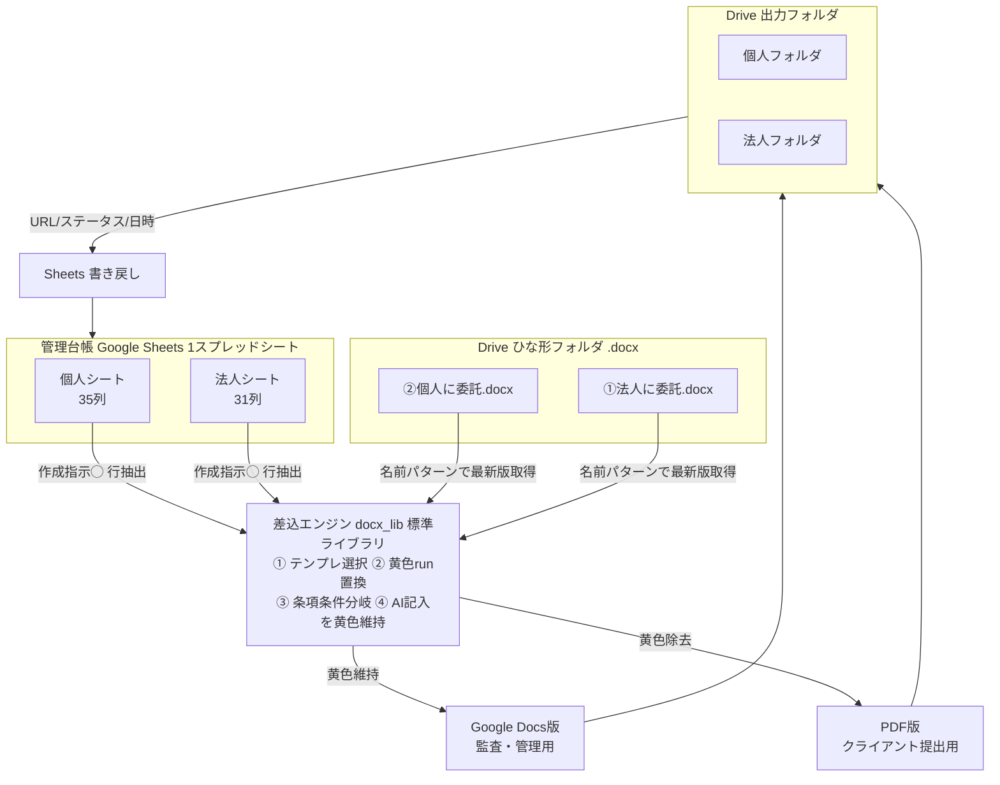
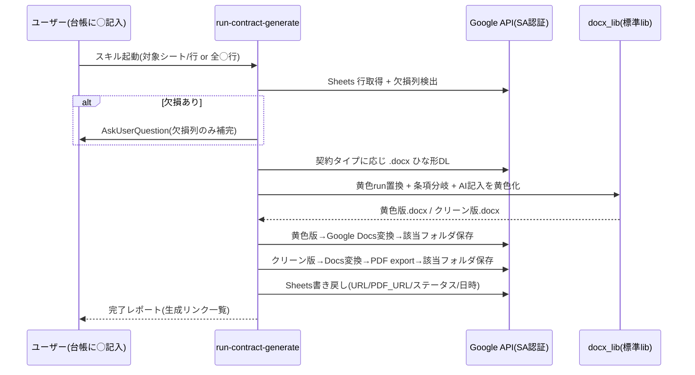

# run-contract-generate 概念設計 (Concept)

> 参考スキル `doc/参考Skill/contract-generator/`(対話駆動・個人向け中心) の**思想・プロンプト・法令ナレッジ**を継承しつつ、
> 実運用(Drive上の.docxひな形 × Sheets管理台帳)に合わせて**「照合・差込エンジン」へパラダイム転換**した新スキルの概念。

## 1. 一言コンセプト

**「管理台帳の1行 × Drive上の法務承認済.docxひな形」を照合し、黄色ハイライトでAI記入を可視化した業務委託契約書を、個人/法人それぞれ自動量産する。**

## 2. 参考スキルから継承するもの / 転換するもの

| 観点 | 参考スキル(contract-generator) | run-contract-generate(本スキル) |
|---|---|---|
| 思想 | 法的リスク最小化・法令準拠・専門家視点 | **継承**(references/00-11 のナレッジを流用) |
| 入力 | ユーザーとの対話8フェーズ | **転換**: 管理台帳(Sheets)が主入力。対話は欠損補完のみ |
| ひな形 | Markdownテンプレート(変数展開) | **転換**: Drive上の.docx(法務承認済書式)を都度取得 |
| 生成 | Markdown→pandoc→DOCX→PDF | **転換**: 標準ライブラリ(docx_lib=zipfile+xml)で.docx直接編集→Google Docs/PDF |
| 対象 | 個人向け中心 | **拡張**: 個人/法人の2系統(法人を新規構築) |
| AI記入の証跡 | なし | **新規**: AI記入箇所を黄色ハイライトで可視化 |
| 量産 | 1件ずつ対話 | **新規**: 台帳「作成指示◯」行を冪等に一括処理 |

## 3. アーキテクチャ概念図

凡例: SSOT=台帳(個人/法人2シート) / TPL=.docxひな形 / ENG=差込エンジン / 黄色維持=Docs, 黄色除去=PDF

## 4. データフロー(1案件)

## 5. 設計原則(参考スキルのベストプラクティス継承)

- **法令条文は番号明記**(著作権法27/28条・フリーランス法等)。ひな形が法務承認済なので条文は改変しない。
- **甲は固定値 (SSOT)**。具体値は `lib/config_auth.load_party_a()` (= `lib/ledger.get_party_a()`) からのみ取得し、台帳に甲列を作らない。フォールバック優先順位の正本は `references/party_a-readme.md`(複製しない)。
- **機微情報最小権限**: 台帳の閲覧権限=契約書作成権限=機微情報閲覧権限。共有範囲を絞る。
- **冪等性**: 台帳の冪等キーで重複生成を防止。再実行で同一行は上書き or スキップ。
- **Progressive Disclosure**: 法令ナレッジ(references/00-11相当)は必要時のみ読込。
- **SSOT分離**: 環境依存ID=`~/.config/contract-generator/google-config.json`(ホーム配下・git管理外)、認証鍵=Keychain(`gdrive-service-account.<keychain-prefix>`)、甲固定値=`lib/config_auth.load_party_a()` (4層フォールバック)。Drive ID / SA メール / Keychain 命名規約の正本は `references/README-setup.md` (Detailed Setup) のみ。他文書からは参照リンク方式とし複製しない。
- **template-mapping.json 二重定義注意**: 甲 4 列 (name/address/representative/title 等) が `fields[]` に追加される際、値そのものではなく `{{party_a.*}}` 参照で書くこと。値直書きは SSOT (`load_party_a`) を迂回し更新時整合崩壊を招く。

## 6. スコープ

- **IN**: 個人/法人2系統の差込生成・黄色二系統出力・法人別紙1-3生成(台帳別紙列から末尾同梱)・台帳の個人/法人2シート整備・Sheets書き戻し。
- **OUT(将来)**: 7専門家による法的レビュー / Notion連携 / Markdown副系 / clients.json交渉パターン。
