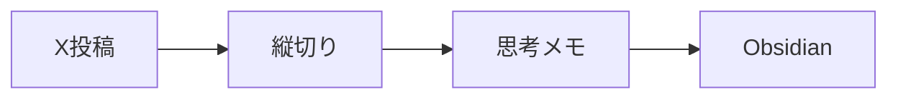
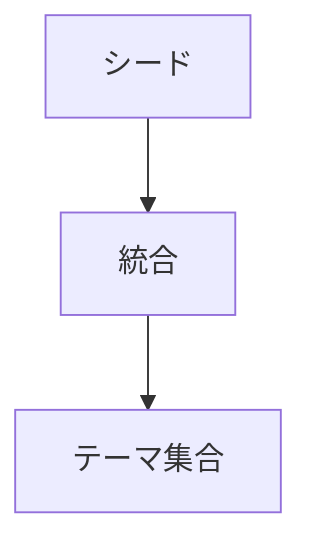
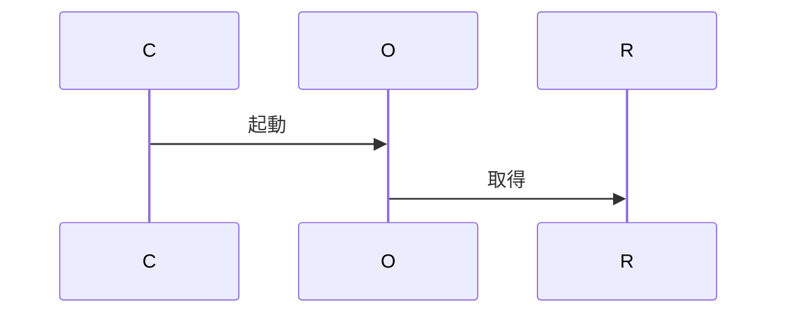
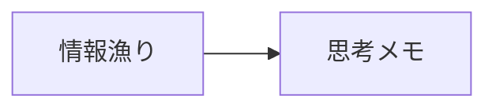
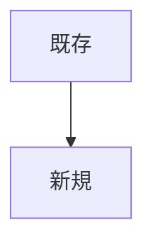

# info-collector-agent — ヒアリング正本（完全版）

- 生成日時: 2026-04-29T14:25:00+09:00
- パターン: A（新規作成）／ Workflow Pattern: B（自動収集配信を主・A従）
- 深度: detailed（40分相当）
- 語彙: expert
- 状態: Gate A 承認済み・harness-creator 引き渡し可能
- value_realized_score（自己評価）: 88 / 100

---

## 0. エグゼクティブサマリ

**真の目的**: 「複数情報源を自分の関心テーマで縦切りキュレーションし、毎朝『本日の思考メモ』を Obsidian に出現させる」

そのメモをタネに、今日の企画・戦略を書き始める**思考のスタートポイント**にする。

**設計選択**: O1 オーケストレータ × T3 ハイブリッドテーマ抽出 × S3 定刻＋オンデマンド両対応

**引き渡しモード**: fast-track（harness-creator は Phase 2 から実装着手可能）

---

## 1. Phase: assumption-challenger（前提逆転）

### 1.1 表層リクエスト

> 情報収集が毎日しんどい・代行してほしい

### 1.2 深層候補（3つ提示）

| ID | ラベル |
| --- | --- |
| D1 | 収集よりも『選別・キュレーション』が本丸 |
| **D2 ✅ 採択** | **収集→要約→アウトプット化まで一気通貫が本丸** |
| D3 | 自分の思考スタイルを学習させた『代理人』が本丸 |

### 1.3 確定した深層課題

情報の収集だけでなく、要約と最終アウトプット形態までを一気通貫で代行させることが本丸。

### 1.4 浮いた時間の使い道

思考・企画・戦略設計に時間を再配分する。

### 1.5 ブラインドスポット

- アウトプット化の部分もしんどいと本人が確認済み
- アウトプット形態が複数で優先順位が未確定
- 『自分の思考スタイルの注入』も部分的に必要な可能性

---

## 2. Phase: user-profiler（ユーザー像）

| 次元 | 値 | 確信度 | 根拠 |
| --- | --- | --- | --- |
| expertise | high | high | 多数のスキルを設計・運用 |
| role | AIコンサルタント兼コンテンツ事業者 | high | ボールト構成 |
| context | 個人事業主・1人運営 | high | 01_Notes の並列構造 |
| constraints | 時間／品質ブレ削減 | high | 4領域すべて毎日 |
| motivation | 思考・戦略設計に時間とエネルギーを再配分 | high | assumption D2 採択 |
| sharing_intent | 4方向マルチアウトプット | high | 確認質問で全選択 |

**vocabulary_tier**: `expert`

### 次フェーズへの含意

- 技術用語はそのまま使ってよい
- アウトプット形態が4方向あるため interviewer で優先順位を引き出す
- 既存スキル群との責務境界を option-presenter で明示する必要あり

---

## 3. Phase: purpose-excavator（真の目的の発掘）

### 3.1 使用技法と往復数

- techniques_used: reverse_brief → 5whys → tacit_extraction → magic_wand
- rounds: 4
- agreement_loop_detected: false

### 3.2 真の目的（verb + object）

**「複数情報源を自分の関心テーマで縦切りキュレーションし、毎朝『本日の思考メモ』を Obsidian に出現させる」**

### 3.3 underlying motivation

思考の延長としてのセカンドブレインを持ち、企画・戦略のスタートポイントにする。

### 3.4 ニュース要約との差別化

複数ソースを『自分の関心テーマ』で縦方向に下ろすキュレーション（横並び要約ではない）。

### 3.5 浮いた時間の使い道（Magic Wand）

毎朝、思考メモをタネに『今日の企画・戦略』を執筆する。

### 3.6 アウトプット優先順位（Reverse Brief で確定）

1. **Obsidian『本日の思考メモ』（最高優先・必須）**
2. Discord/Slack 通知（思考メモのサマリ＋ピン留めシグナル）
3. （副次）X長文/スライド/提案資料への派生はユーザー手動 or 別スキル委譲

### 3.7 暗黙知の所在（Tacit Extraction）

- where: 過去の X 投稿・講座資料・クライアント会話に現れているが、テーマとして言語化されていない
- extraction_strategy_hint: 過去アウトプットを解析して関心テーマ集合を逆推定し、定期的に再学習する仕組み

### 3.8 残課題（option-presenter へ送る）

- 関心テーマ抽出のサイクル（毎日／週次／月次）
- 既存類似スキルとの責務境界
- 情報源の絞り込み（X TL のカバー範囲）
- 配信タイミング（毎朝定刻／オンデマンド）

---

## 4. Phase: option-presenter（選択肢提示と確定）

### 4.1 責務境界

| ID | ラベル | Pro | Con | Weight |
| --- | --- | --- | --- | --- |
| **O1 ✅** | **オーケストレータ** | 重複実装なし・既存資産活用 | 既存スキルAPI契約に依存 | 軽 |
| O2 | ハイブリッド | 緩やか結合 | ファイル形式調整が必要 | 中 |
| O3 | 独立 | 依存ゼロ | 重複実装・保守コスト大 | 重 |

### 4.2 テーマ抽出

| ID | ラベル | Pro | Con | Weight |
| --- | --- | --- | --- | --- |
| T1 | 静的シード | シンプル | 更新追随しない | 軽 |
| T2 | 動的抽出 | 暗黙知逆推定 | 計算コスト・精度ブレ | 重 |
| **T3 ✅** | **ハイブリッド** | バランス・進化 | 実装やや複雑 | 中 |

### 4.3 配信タイミング

| ID | ラベル | Pro | Con | Weight |
| --- | --- | --- | --- | --- |
| S1 | 毎朝定刻 cron | ルーチン化 | 緊急情報を逃す | 軽 |
| S2 | オンデマンドのみ | 柔軟 | 習慣化しにくい | 軽 |
| **S3 ✅** | **両対応** | ベース＋必要時対応 | 起動経路2系統の整合 | 中 |

### 4.4 コネクタ選択

- **input_sources**: arxiv-paper-reporter / x-post-reporter / ai-release-reporter + 会話URL貼り付け
- **knowledge_assets**: Obsidian Vault読込 / 過去X投稿アーカイブ / 講座資料
- **outputs**: Obsidian Markdown / Discord Webhook
- **scheduler**: cron 定刻 / スラッシュコマンドでオンデマンド起動

---

## 5. Phase: visualizer（図解5枚）

各図に「言いたい一言」を1行付記。ノード数 7±2、日本語10文字以内、Font Awesome アイコン使用。

### 図1. 全体アーキテクチャ

**言いたい一言**: 既存3スキルの出力を関心テーマで縦切りにして思考メモに変える。

**凡例**: 青=情報源 / 黄=コア / 緑=出力先

---

### 図2. テーマ抽出ハイブリッド

**言いたい一言**: 手動シードを動的補強し週次でチューニング。

**凡例**: 青=静的 / 黄=動的 / 緑=統合

---

### 図3. 日次パイプライン

**言いたい一言**: 定刻またはオンデマンドで起動。

**凡例**: 起動経路2系統、出力2方向

---

### 図4. Before/After

**言いたい一言**: 情報漁りから思考メモへ。

**凡例**: 赤=現状 / 緑=理想

---

### 図5. 責務境界

**言いたい一言**: 既存=収集の専門家、新規=思考メモ編集者。

**凡例**: 青=既存 / 黄=新規

---

### visualization-mandatory-rules チェック

- [x]  ノード数 7±2 を全図遵守
- [x]  日本語ラベル10文字以内
- [x]  色凡例つき
- [x]  Font Awesome アイコン使用
- [x]  各図に『言いたい一言』付記
- [x]  専門用語は最小化

---

## 6. 5軸サマリ（最終確定版）

| 軸 | 内容 | 深度 |
| --- | --- | --- |
| 出力先 | Obsidian Vault + Discord/Slack | deep |
| 情報源 | 既存3スキル + 会話URL貼り付け | deep |
| 共有相手 | 自分／X／クライアント／チーム | standard |
| 真の課題 | 収集→要約→アウトプットを一気通貫で代行 | deep |
| **ナレッジ資産（MUST）** | Obsidian + 過去X投稿 + 講座資料、暗黙知抽出ハイブリッド、週次更新 | deep |

### ナレッジ抽出パイプライン

- **ingest**: Markdown / X投稿 / URL / PDF
- **analysis**: LLM要約 + Embeddings によるテーマクラスタリング + 静的シードとの統合
- **storage**: Obsidian + JSON テーマ集合ファイル
- **retrieval**: テーマキーワード検索 + RAG
- **update**: <built-in method update of dict object at 0x10aa43340>

---

## 7. 設計選択サマリ（option-presenter で確定）

| 軸 | 採択 | 理由 |
| --- | --- | --- |
| 責務境界 | **O1 オーケストレータ** | 既存スキルの再利用・重複実装回避 |
| テーマ抽出 | **T3 ハイブリッド** | 静的シード+動的抽出+週次チューニング |
| 配信タイミング | **S3 両対応** | 定刻でルーチン化、オンデマンドで柔軟性 |

### アウトプット優先順位

1. Obsidian『本日の思考メモ』（最高優先・必須）
2. Discord/Slack 通知（サマリ＋ピン留めシグナル）
3. （副次）派生は別スキルへ委譲

---

## 8. 未解決事項（harness-creator 引き継ぎ）

| 質問 | ブロッキング | 委譲先 |
| --- | --- | --- |
| クライアント実名・契約金額の除外範囲 | × | harness-creator |
| 情報源の絞り込み（X TLアカウント数・arXivカテゴリ範囲） | × | harness-creator |
| Discord/Slack のどちらをメイン通知先にするか | × | harness-creator |
| テーマ集合ファイルのスキーマと更新ジョブ実装 | ○ | harness-creator |

---

## 9. harness-creator への申し送り（handoff-contract）

- `recommended_next.mode = fast-track`
- `skip_to_phase = Phase 2`
- 理由: 5軸全 verified、設計選択も確定済み、要件定義フェーズはスキップ可能
- intake.json を起点に Phase 2 から実装着手してよい

---

## 10. Phase: self-updater（自己進化結果）

### 10.1 メトリクス

- candidates_detected: 3
- candidates_applied: 3
- skipped_duplicates: 0
- value_realized_score_estimate: **88 / 100**

### 10.2 スコア根拠

5軸全 verified、purpose 動詞+目的語に分解済、設計選択も確定。

**控除点**:

- アウトプット形態の優先順位確定が purpose-excavator まで持ち越された（-7）
- テーマ集合スキーマが harness-creator 委譲で残った（-5）

### 10.3 question-bank.md に追加された質問

| カテゴリ | 技法 | 質問文 |
| --- | --- | --- |
| 真の課題 | Reverse Brief | 完成して1週間使った朝、最初に開いたときに一番見たいアウトプットは？ |
| ナレッジ資産 | Tacit Extraction | あなたの『関心テーマ』は (a)言語化済 (b)部分的 (c)暗黙知のみ (d)可変 のどれ？ |
| 責務境界 | Option Pivot | このスキルは(1)オーケストレータ (2)ハイブリッド (3)独立 のどれ？ |

### 10.4 セッション観察

- expert ユーザーには interviewer 段階で責務境界を確定するほうが効率的
- ナレッジ資産軸を multiSelect で聞くと『全部選択』になりやすい
- Reverse Brief 質問が決定打になった

### 10.5 次フェーズスキップ

- notion-publisher（MCP切断 → 手動復旧後に共有完了）
- slack-notifier（MCP切断）

---

## 11. 出力ファイル一覧（`.claude/skills/skill-intake-interviewer/output/info-collector-agent/`）

- `kickoff.json` — パターンA／detailed／4領域すべて選択
- `assumption.json` — D2 採択
- `profile.json` — expertise=high／expert 語彙
- `sheet.md / sheet-progress.json` — 5軸 filled
- `purpose.json` — true_purpose 確定、4 rounds
- `options.json` — O1 / T3 / S3 採択
- `figures.md` — Mermaid 図解5枚
- `intake.md / intake.json` — Gate A 通過版
- `notion-payload.md` — Notion 投稿用本体
- `qb-candidates.json` — 質問銀行追加候補3件
- `self-update.json` — value_realized_score=88

