# ハンドオフ契約 JSON Schema

`skill-intake-handoff` SubAgent の最終出力 `intake.json` の契約。**スキーマ正本は `references/intake.schema.json` (schema_version 2.0.0, `sections` 12 章構造)** であり、本ファイルは配置規約と下流 (harness-creator / plugin-dev-planner) への入力契約マッピングを定める。`run-skill-create` はこの JSON を読み込んで Phase 0-0 を簡略化または飛ばす。

## ファイル配置

```
output/<skill-name-hint>/
├── intake.md            # 人間用・正本
├── intake.json          # harness-creator / plugin-dev-planner 用・副本（references/intake.schema.json 準拠）
├── notion-url.txt       # 公開後の Notion URL
├── notion-blocks.json   # dry-run 用 Notion ブロック JSON
└── self-update.json     # question-bank への追記候補
```

Slack ログは本スキルのスコープ外（差別化済み）。

## JSON Schema (正本参照)

intake.json の正規スキーマは **`references/intake.schema.json` (schema_version 2.0.0, `sections` 12 章構造) を唯一の正本**とする。本ファイルへのスキーマ複製 (インライン写し) は禁止する (cross-boundary 複製禁止 invariant)。実形状の例は `fixtures/example-team-onboarding/intake.json` / `fixtures/example-data-quality-survey/intake.json` を参照する。

- ルート必須: `schema_version` (const `"2.0.0"`) / `source_of_truth` / `sections` / `notion_target`
- `sections` は `0_executive_summary` 〜 `11_artifact_index` の 12 キー必須 (`additionalProperties: false`)
- 旧 v1 (schema_version 1.0.0, flat 構造: `purpose.*` / `five_axes.*` / `recommended_next.*` 直下) は廃止済み。v1 パスの残置参照を見つけたら本ファイルでなく正本 schema (v2 `sections.*`) へ追従させること
- `sections.0_executive_summary.workflow_pattern` (スキル種別軸) の値ラベル正本は `notion-db-schema.json#/properties/ワークフロー` を参照する。この A-E は mode 軸 (run-intake-next-action の引き渡しモード A-E/P) およびパターン軸 (ライフサイクル A-E) とは独立した分類である。二重定義防止のためラベルは本ファイルへベタ書きせず正本を単一真実源とする

## バリデーション

- `scripts/validate_intake_schema.py` が `references/intake.schema.json` 準拠を検証 (pre-publish hook 兼用。cross-field rule `handoff_mode_consistency` = §0 `handoff_mode` と §9 `recommended_next.mode` の一致検証を含む)
- `scripts/validate_intake.py` が 5 軸 + user_profile の必須キー存在を検証 (v1 flat / v2 双方を正規化して受理する後方互換レイヤー)
- 必須欠落 → ヒアリング差し戻し
- `sections.8_open_questions.blocking_count` は 0 必須 (blocking 残存のまま handoff へ進めない)
- `sections.6_five_axes_summary.axes[]` は 5 軸 (knowledge_asset 含む) 全件必須
- `scripts/validate-procedure-completeness.py` が `sections.6_five_axes_summary.procedure` (現状手順) の mode 別完全性 (detailed の `steps[]` / overview_fallback の `difficulty_flag`+`overview`) と、as-is フィールド (`procedure.*` / 真の課題 content) への to-be 語彙非混入 (contamination check) を検証する。結果は `validation.procedure_completeness` に格納
- `scripts/quality_gate.py --require-procedure` が true_purpose (本質的課題) と procedure (現状手順) の両方非空を強制し、いずれか欠落・to-be 混入のまま handoff へ進めない (procedure 拡張 intake のみ発火。procedure 導入前の旧 intake は migration_warn で通す後方互換)

## harness-creator 入力契約マッピング

`run-skill-create` (`plugins/harness-creator/skills/run-build-skill/SKILL.md`) は、ユーザーが intake 完了後に別途明示起動した場合に限り、本 intake.json を入力として **ビルドフロー** を駆動する。ただし Notion 指定ありの intake は、`notion-log.json.status=="published"` と `notion-publish-result.json.page_id` が `notion_target` と一致するまで Step 2 build へ進めない。intake 側は next-action 推奨を出して停止し、`run-skill-create` / `run-build-skill` を起動しない。最終成果物として **SubAgent ファイル (agent-template.md の 9 セクション固定構造)** を量産する。「9 セクション」は agent-template.md の正本構造を指し、build-steps.md の **Step 1〜9** (ビルドフロー手順) とは別軸である。両軸のマッピングを以下に明示する。

### 軸 A: SubAgent 9 セクション正本 (agent-template.md) ← intake.json 派生元

`plugins/harness-creator/skills/run-build-skill/references/agent-template.md` で定義される SubAgent ファイルの 9 セクション固定構造に、intake.json の各フィールドがどう投入されるか。

| # | SubAgent セクション | intake.json 主派生元 (v2 sections パス) | 役割 (Layer 対応) |
|---|---|---|---|
| 1 | Frontmatter (name/description/tools/model) | `skill_name_hint` + `sections.9_handoff_contract.recommended_next.mode` + `sections.6_five_axes_summary` から `pair`/`kind` 推定 | エージェント識別と最小権限宣言 |
| 2 | Purpose | `sections.3_purpose_excavator.true_purpose` + `.underlying_motivation` | Layer 1 不変定義 (役割の正本) |
| 3 | Inputs | `sections.4_option_presenter.decision_tables[].options[adopted=true]` + `sections.4_option_presenter.connectors` | Layer 2 ドメイン定義 (前提・参照リソース) |
| 4 | Outputs | `sections.9_handoff_contract.recommended_next.skip_to_phase` + `sections.11_artifact_index.base_path` 規約 | Layer 6 出力契約 (成果物パス + JSON 雛形) |
| 5 | Steps | `sections.3_purpose_excavator.output_priority` の段階分解 + `sections.7_design_decisions.adoptions` + **`sections.6_five_axes_summary.procedure` (現状手順 as-is)** | Layer 5/6 実行仕様 (思考プロセス番号付き)。procedure の `steps[]` (action/input/output/tool/frequency) を build 時の手順雛形として参照し、手順推測による手戻りを排除する。to-be (最適化・理想手順) の設計は build 側の責務 |
| 6 | Constraints | `sections.2_user_profile.dimensions[dim=constraints]` + `sections.8_open_questions.questions[blocking=true]` | Layer 4 ガードレール (禁止事項) |
| 7 | Prompt Templates | `sections.2_user_profile.vocabulary_tier` で語彙難易度決定 + `responsibilities[]` anchor | Layer 7 実発話例 (responsibility ごとに Round 配置) |
| 8 | Self-Evaluation | `sections.6_five_axes_summary.axes[].depth` + `sections.0_executive_summary.value_realized_score` | quality-rubric.md 5 次元採点の重点定義 |
| 9 | Handoff | `sections.9_handoff_contract.recommended_next.mode` + 次 agent の接続情報 | 次 agent と引き継ぎデータ |

**lint Tier 2 (未発効・将来予定)**: intake.json の `responsibilities[]` (契約未追加) → SubAgent.md の `<!-- responsibility: <R-id> -->` anchor 集合一致 (kind ∈ {run, assign} 対象)。`responsibilities[]` が正本 schema (`references/intake.schema.json`) へ追加された時点で発効する。現時点では必須ではない。

### 軸 B: ビルドフロー Step 1〜9 ← intake §0〜§11 投入箇所

`build-steps.md` のビルド手順 (Step 1〜9; Step 3.5/7.5 を含み実質 11 段だが正規 9 ステップ表記) に、skill-intake が生成する §0〜§11 をどこで読むか。

| skill-intake §x (canonical_map) | intake.json フィールド (v2 sections パス) | harness-creator Step | 役割 |
|---|---|---|---|
| §0 executive_summary | `sections.0_executive_summary` (pattern / depth / true_purpose_oneliner / handoff_mode) | Step 1 (skip_to_phase 判定根拠) | スキル名候補・パターン・引き渡しモードを 1 枚で読ませる |
| §1 assumption_challenger | `sections.1_assumption_challenger.surface_request` / `.adopted_deep_problem` | Step 1 (kind 確定の前提) | 表層 vs 深層の分離を brief に渡す |
| §2 user_profile | `sections.2_user_profile.dimensions` / `.vocabulary_tier` | Step 1 (語彙難易度) / Step 2 (テンプレ選択) | vocabulary_tier を SubAgent §7 へ伝搬 |
| §3 purpose_excavator | `sections.3_purpose_excavator.true_purpose` / `.underlying_motivation` / `.output_priority` | Step 1 (true_purpose 正本) / Step 5 (フォーク評価) | SubAgent §2 Purpose の正本 |
| §4 option_presenter | `sections.4_option_presenter.decision_tables[].adopted_id` + `.connectors` | Step 2 (テンプレ展開) / Step 3 (補助ファイル生成) | SubAgent §3 Inputs の初期値 |
| §5 visualizer (図解 5 枚) | `sections.5_visualizer.figures[]` | Step 3 (`templates/`/`assets/` 配置候補) | 図解資産を skill 本体へ移植 |
| §6 five_axes_summary | `sections.6_five_axes_summary` (axes 5 軸 + intent_contract + knowledge_pipeline + **procedure 現状手順**) | Step 1 / Step 5 (手順雛形) / Step 6 ゲート判定 | rubric score >= 80 の前提。procedure (as-is 現状手順) は Step 5 の Steps 段階分解の入力として手順推測を排除する |
| §7 design_decisions | `sections.7_design_decisions.adoptions` / `.output_priority_finalized` | Step 2 (kind / pair / hooks の宣言値) | SubAgent §1 Frontmatter の `pair`/`kind`/`script_refs` |
| §8 open_questions | `sections.8_open_questions.questions[]` (blocking / defer_to) | Step 1 (defer_to=harness-creator 再尋問) | blocking=true で Step 6 ゲート停止 |
| §9 handoff_contract | `sections.9_handoff_contract.recommended_next` (mode / skip_to_phase / reason) | Step 1 → Step 2 ジャンプ条件 | mode=fast-track で Step 1 簡略化 |
| §10 self_updater | `sections.10_self_updater` (+ `self-update.json`) | (harness-creator スコープ外) | skill-intake 自己進化専用 |
| §11 artifact_index | `sections.11_artifact_index.base_path` / `.artifacts[]` | Step 3.5 再現性トレース | skill-build-trace.json の source_docs に登録 |

Step 1 が読むのは §1/§2/§3/§6/§8/§9。Step 2 は §4/§7。Step 3 は §5/§11。§0/§10 は人間レビュー専用。

### 軸 A と軸 B の関係

軸 B (ビルドフロー) は **手順**、軸 A (SubAgent 9 セクション) は **成果物の構造正本**。intake.json は両軸を同時に駆動するため、本契約では「intake.json → 軸 A 派生 → 軸 B の各 Step が軸 A を充填」という 2 段の責務分離を保証する。`agent-template.md` 改版時は軸 A 表を、`build-steps.md` 改版時は軸 B 表を独立に更新すること。

## plugin-dev-planner 分岐 (mode P)

`run-intake-next-action` が `mode=P` (plugin 規模構想) を確定した場合、引き渡し先は `run-skill-create` でなく **`plugins/plugin-dev-planner/skills/run-plugin-dev-plan` の R1 (elicit-goal)** になる (`next-action.json.handoff_target="plugin-dev-planner"`)。利用者向けの次アクションは `/plugin-dev-plan "<構想要約>" --intake-json output/<hint>/intake.json --next-action-json output/<hint>/next-action.json` とし、intake.json と next-action.json の以下の § を R1 の材料として渡す:

| intake.json §x (v2 sections パス) | R1 (goal-spec) への写像 |
|---|---|
| `sections.0_executive_summary` (true_purpose_oneliner / pattern / handoff_mode) | `purpose` / `background` の推定材料 |
| `sections.3_purpose_excavator` (true_purpose / underlying_motivation / output_priority) | `goal` (観測可能な完了形 1 文) と `checklist` の導出材料 |
| `next-action.json.split_candidates[]` (mode P 判定時の複数コンポーネント/skill 候補) | `--next-action-json` 経由でコンポーネント分解 (R2) へ渡す初期候補 |

受け側契約の正本は `plugins/plugin-dev-planner/skills/run-plugin-dev-plan/references/io-contract.md` §9 (intake.json は**任意の構造化入力**であり必須ではない)。harness-creator 分岐 (mode A-D) と同じく、intake 側は推奨を出して停止し `run-plugin-dev-plan` を起動しない。

## `run-skill-elicit` との互換

`run-skill-elicit` が生成する brief.json も、本スキーマの `five_axes` 部分を空オブジェクトとして許容することで吸収できる。`run-skill-create` 側は両者を区別せず読み込めるよう、本スキーマを上位互換として運用する。

## 12 Agent × 出力 × Script 依存 DAG

実線矢印 = ファイル依存（前工程の出力を入力とする）。点線矢印 = script 呼出（agent → scripts/*.py）。subgraph はフェーズ区分。

```mermaid
flowchart TD
    subgraph P0[Phase 0 起動]
        A_kickoff(["kickoff"])
        F_kickoff["kickoff.json"]
        A_kickoff --> F_kickoff
    end

    subgraph P1[Phase 1 仮説と表層充足]
        A_assumption(["assumption-challenger"])
        F_assumption["assumption.json"]
        A_profiler(["user-profiler"])
        F_profile["profile.json"]
        A_interviewer(["interviewer"])
        F_sheet["sheet.md"]
        A_assumption --> F_assumption
        A_profiler --> F_profile
        A_interviewer --> F_sheet
    end

    subgraph P2[Phase 2 深層と選択肢]
        A_purpose(["purpose-excavator"])
        F_purpose["purpose.json"]
        A_option(["option-presenter"])
        F_options["connector_choice.json / options.json"]
        A_purpose --> F_purpose
        A_option --> F_options
    end

    subgraph P3[Phase 3 図解と要約]
        A_visualizer(["visualizer"])
        F_visuals["visuals.json + visuals/*.svg"]
        A_summarizer(["summarizer"])
        F_summary["summary.md / summary.json"]
        A_visualizer --> F_visuals
        A_summarizer --> F_summary
    end

    subgraph P4[Phase 4 判定と統合]
        A_next(["next-action-advisor"])
        F_next["next-action.json"]
        A_handoff(["handoff"])
        F_intake["intake.md / intake.json"]
        A_next --> F_next
        A_handoff --> F_intake
    end

    subgraph P5[Phase 5 公開]
        A_notion(["notion-publisher"])
        F_notion["notion-blocks.json / notion-manifest.json / notion-url.txt"]
        A_notion --> F_notion
    end

    subgraph P6[Phase 6 自己進化]
        A_self(["self-updater"])
        F_self["self-update.json / question-bank.md 追記"]
        A_self --> F_self
    end

    %% ファイル依存（実線）
    F_kickoff --> A_assumption
    F_kickoff --> A_profiler
    F_assumption --> A_profiler
    F_profile --> A_interviewer
    F_sheet --> A_purpose
    F_purpose --> A_option
    F_sheet --> A_visualizer
    F_purpose --> A_visualizer
    F_kickoff --> A_summarizer
    F_assumption --> A_summarizer
    F_profile --> A_summarizer
    F_sheet --> A_summarizer
    F_purpose --> A_summarizer
    F_options --> A_summarizer
    F_visuals --> A_summarizer
    F_summary --> A_next
    F_purpose --> A_next
    F_options --> A_next
    F_kickoff --> A_next
    F_kickoff --> A_handoff
    F_assumption --> A_handoff
    F_profile --> A_handoff
    F_sheet --> A_handoff
    F_purpose --> A_handoff
    F_options --> A_handoff
    F_visuals --> A_handoff
    F_summary --> A_handoff
    F_next --> A_handoff
    F_intake --> A_notion
    F_visuals --> A_notion
    F_summary --> A_notion
    F_next --> A_notion
    F_intake --> A_self
    F_summary --> A_self
    F_next --> A_self

    %% Script 呼出（点線）
    A_handoff -.-> S1[/"render-intake-final.py"/]
    A_handoff -.-> S2[/"convert_md_to_json.py"/]
    A_handoff -.-> S3[/"validate_intake.py"/]
    A_handoff -.-> S4[/"check_completeness.py"/]
    A_handoff -.-> S5[/"detect_contradictions.py"/]
    A_handoff -.-> S6[/"extract_open_questions.py"/]
    A_handoff -.-> S7[/"cross_check.py"/]
    A_visualizer -.-> S8[/"select_diagrams_per_section.py"/]
    A_visualizer -.-> S9[/"compose_diagram.py"/]
    A_visualizer -.-> S10[/"validate_mermaid.py"/]
    A_visualizer -.-> S11[/"render_to_svg.py"/]
    A_visualizer -.-> S12[/"enforce_visualization_rules.py"/]
    A_notion -.-> S13[/"keychain_get_secret.py"/]
    A_notion -.-> S14[/"verify_notion_schema.py"/]
    A_notion -.-> S15[/"render_to_image.py"/]
    A_notion -.-> S16[/"prepare_notion_assets.py"/]
    A_notion -.-> S17[/"verify_notion_assets.py"/]
    A_notion -.-> S18[/"intake_publish_pipeline.py"/]
    A_self -.-> S19[/"measure_value_realized.py"/]
    A_self -.-> S20[/"update_question_bank.py"/]
    A_self -.-> S21[/"append_eval_log.py"/]
```



凡例:
- 楕円 `()` = agent ノード（12 個）。
- 矩形 `[]` = 中間/最終ファイル。
- 平行四辺形 `[/.../]` = scripts/*.py 呼出。
- 実線 = ファイル依存、点線 = script 呼出。
